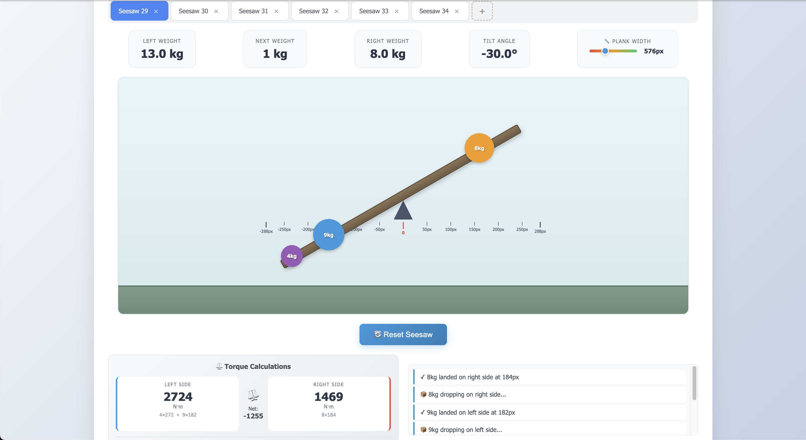

# Seesaw Tork Simülasyonu

Tork tabanlı fizik mekanikleri ile interaktif seesaw simülasyonu. Pure JavaScript ile geliştirilmiş, multi-seesaw desteği olan eğitici bir fizik simülasyonu.



## Özellikler

### Fizik Motoru
- Tork hesaplaması: `torque = weight × distance`
- Açı formülü: `angle = clamp((rightTorque - leftTorque) / 10, -30°, 30°)`
- Gerçekçi düşüş ve bounce animasyonları
- Plank koordinat sistemine göre nesne konumlandırma

### Multi-Seesaw Sistemi
- Maksimum 10 adet bağımsız seesaw
- Tab-based navigation
- Her seesaw'ın kendi state'i ve LocalStorage kaydı
- Dinamik ekleme/silme

### Kullanıcı Arayüzü
- Mesafe ölçeği (ruler) - plank üzerinde pixel bazlı mesafe gösterimi
- Tork hesaplama paneli - sol/sağ tork, net tork ve formüller
- Dinamik plank genişliği kontrolü (400-1000px)
- Gerçek zamanlı istatistikler (ağırlık, açı)
- Preview sistemi - hover ile nesne konumunu önizleme

### Ses Efektleri
- Web Audio API ile synthesized sesler
- Nesne düşüş sesi
- İniş sesi (ağırlığa göre ton değişimi)
- Reset butonu için melodi

### Kalıcılık
- LocalStorage ile otomatik kayıt
- Sayfa yenilendiğinde state geri yükleme
- Her seesaw'ın bağımsız kaydı

## Teknolojiler

- **Pure JavaScript (ES6+)** - Framework/library kullanılmadı
- **HTML5** - Semantic markup
- **CSS3** - Modern styling, gradients, transforms
- **Web Audio API** - Ses efektleri için
- **LocalStorage API** - State persistence

## Proje Yapısı

```
seesaw_tork/
├── index.html          # Ana HTML yapısı
├── css/
│   └── styles.css      # Tüm stil tanımları
├── js/
│   ├── config.js       # Sabitler ve konfigürasyon
│   ├── storage.js      # LocalStorage yönetimi
│   ├── Seesaw.js       # Seesaw class'ı (fizik, render, events)
│   └── app.js          # SeesawManager ve AudioManager
└── README.md
```

## Çalıştırma

```bash
# HTTP server başlat
python3 -m http.server 8080

# Tarayıcıda aç
open http://localhost:8080
```

## AI Kullanımı

Bu projede AI araçları aşağıdaki durumlarda kullanılmıştır:

- **Commit mesajları**: Debugging ve mimari kararlar için commit mesajlarının yazılmasında
- **Syntax hataları**: Kod yazımı sırasında oluşan syntax error'ların tespiti ve düzeltilmesinde
- **Debugging**: Hata ayıklama süreçlerinde
- **Kod tamamlama**: IDE tab tuşu ile kod tamamlama (autocomplete) özelliği

**Not**: Ana kod yapısı, fizik hesaplamaları, algoritmalar ve mimari kararlar manuel olarak geliştirilmiştir.

## Lisans

MIT
